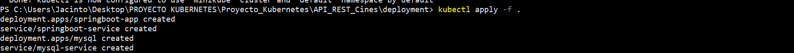
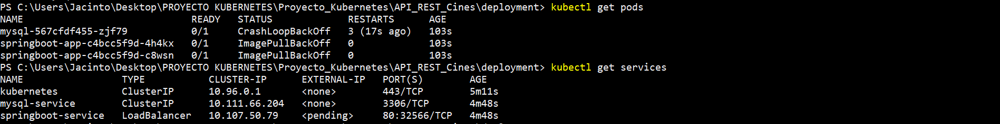
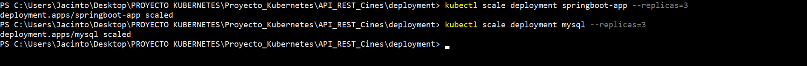
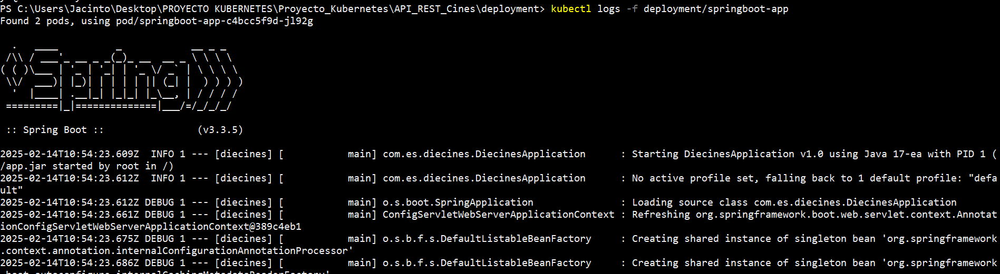
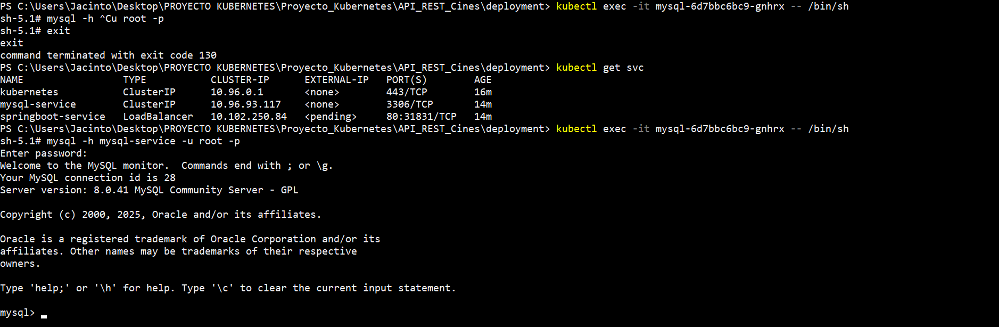
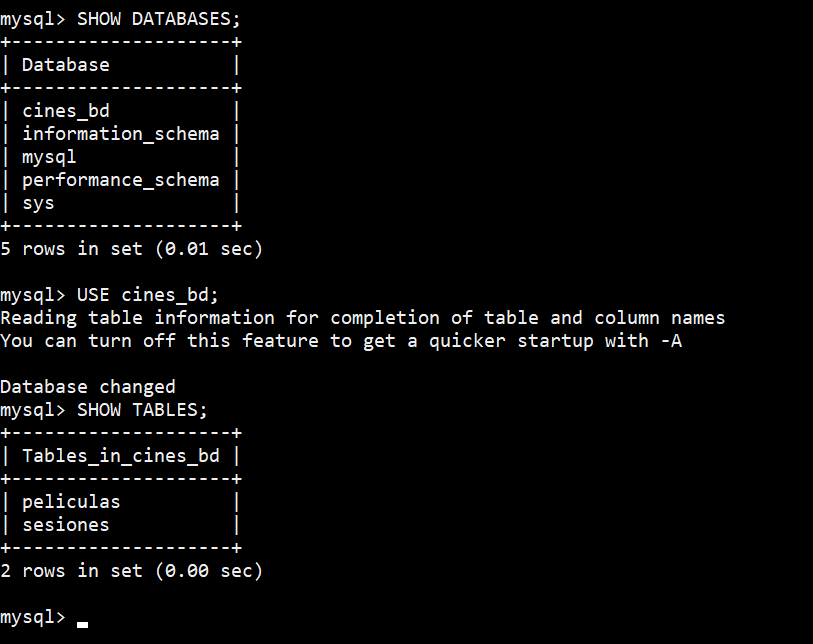

# PROYECTO KUBERNETES - API REST CINES

## Alfonso Jesús Anillo Romero
## Jacinto Reguera González


## Despliegue de Aplicaciones Web

## 2º DAW

---

## ÍNDICE
- [1 - Requisitos previos](#1--requisitos-previos)
- [2 - Proyecto Spring Boot](#2--proyecto-spring-boot)
- [3 - Crear un dockerfile](#3--crear-un-dockerfile)
- [4 - Construir y subir la imagen a docker](#4---construir-y-subir-la-imagen-a-docker)
- [5 - Definir los manifiestos de Kubernetes](#5--definir-los-manifiestos-de-kubernetes)
  - [5.1 - Crear un deployment](#51---crear-un-deployment)
  - [5.2 - Crear un service](#52---crear-un-service)
  - [5.3 - Crear un mysql-deployment y mysql-service](#5-3---crear-un-mysql-deployment-y-mysql-service)
- [6 - Desplegar en Kubernetes](#6---desplegar-en-kubernetes)
- [7 - Escalar y monitorizar la aplicación](#7---escalar-y-monitorizar-la-aplicación)
---


## 1- Requisitos previos

Se debe tener instalado:

1. **Java y Gradle:** Java debe estar instalado en una versión 17 o mayor. Gradle permite la automatización de compilación de código abierto
2. **Spring Boot:** Framework de código abierto que sirve para crear aplicaciones autónomas de producción que se ejecutan en una máquina virtual Java.
3. **Docker:** para construir imágenes de contenedor.
4. **Minikube:** para crear clústers y realizar pruebas locales.
5. **Kubectl:** herramienta de líneas de comando para interactuar con kubernetes.

---

## 2- Proyecto Spring Boot
El proyecto seleccionado ya se realizó con anterioridad, y es el denominado **"APIRestPelículas"**. 

Existen dos entidades, **Pelicula** y **Sesion**, con una relación **Many To One**, donde una película puede tener muchas películas, pero una sesión corresponde a una sóla película.
**Película** tiene las siguientes entidades: *id*, *title*, *director*, *time*, *trailer*, *posterImage*, *screenshot*, *synopsis*, *trailer* y *rating*.
**Sesión** tiene las entidades: *id*, *pelicula*, *room_id* y *date*.

En ambas entidades, se implementan todas las operaciones de CRUD.

Por último, es muy importante comentar un cambio en **applications.properties** necesario para poder ejecutar correctamente el proyecto. 
Hay que sustituir la línea de spring.datasource.url y, donde pone *localhost*, hay que cambiarlo por *mysql-service*. 

## 3- Crear un dockerfile
Así que, ahora hay que realizar un archivo **dockerfile** para establecer un conjunto de comandos o instrucciones. Estos comandos/instrucciones se ejecutan sucesivamente para realizar acciones sobre la imagen base para crear una nueva imagen Docker.

*Dockerfile*:

```
FROM openjdk:17-jdk-alpine
VOLUME /tmp
ARG JAR_FILE=build/libs/*.jar
COPY ${JAR_FILE} app.jar
ENTRYPOINT ["java","-jar","/app.jar"]
EXPOSE 8080
```

Qué indica cada línea:

*FROM openjdk:17-jdk-alpine*: define la imagen base para el contenedor. Usa la imagen de openjdk en su versión Alpine, optimizada para contenedores.

*VOLUME /tmp*: crea el volumen dentro del contenedor. Esto conlleva mejoras en el rendimiento.

*ARG JAR_FILE=build/libs/.jar*: ARG se usa durante el proceso de construcción. Indica la ubicación del JAR de la aplicación, generado con Gradle.

*COPY ${JAR_FILE} app.jar*: copia el archivo JAR generado desde la máquina host al contenedor.

*ENTRYPOINT ["java","-jar","/app.jar"]*: define el comando de incicio del contenedor.

*EXPOSE 8080*: indica que la aplicación dentro del contenedor se escucha en el puerto 8080.

---

## 4 - Construir y subir la imagen a Docker
A través del dockerfile, se sube la imagen a Docker.

```
docker build -t usuario/nombreImagen .
docker run -p 8000:8080 usuario/nombreImagen
```

---

## 5- Definir los manifiestos de Kubernetes:
A través de archivos **yaml**, que son los archivos o conjunto de archivos que describen el estado deseado de los recursos en el clúster de Kubernetes.

### 5.1 - Crear un deployment:
Controlador de la plataforma. Define el clúster que se va a utilizar, el número de réplicas de la aplicación y la gestión de las actualizaciones.

```
apiVersion: apps/v1
kind: Deployment
metadata:
  name: springboot-app
  labels:
    app: springboot-app
spec:
  replicas: 2
  selector:
    matchLabels:
      app: springboot-app
  template:
    metadata:
      labels:
        app: springboot-app
    spec:
      containers:
        - name: springboot-app
          image: tu-usuario/nombre-aplicacion
          ports:
            - containerPort: 8080
```

**Comandos más relevantes:**

*apiVersion: apps/v1* : indica la versión de la API de Kubernetes que se está utilizando.

*kind: Deployment*:  define que el recurso es un Deployment.

*metadata.name: springboot-app*: asigna un nombre único. 

*labels.app: springboot-app*: etiqueta el recurso para facilitar su identificación.

*replicas: 2*: indican que se ejecutarán 2 réplicas

*selector.matchLabels.app: springboot-app*: para gestionar los pods que tenga la etiqueta app: springboot-app.

*metadata.labels.app: springboot-app*: se asegura de que los Pods generados tengan la misma etiqueta del selector.

*containers*: define los contenedores dentro del Pod.

*image: usuario/nombre*: la imagen se usará para crear el contenedor.

*ports.containerPort: 8080*: expone el puerto 8080 dentro del contenedor.


### 5.2 - Crear un Service:
Para almacenar configuraciones externas a la aplicación. Puede establecer cambios en la configuración sin tener que modificar el archivo .dockerfile.

```
apiVersion: v1
kind: Service
metadata:
  name: springboot-service
spec:
  selector:
    app: springboot-app
  ports:
    - protocol: TCP
      port: 80
      targetPort: 8080
  type: LoadBalancer
```

**Comandos más importantes:*

*kind: Service*: especifica que el recurso es un Service.

*name: springboot-service*: asigna un nombre al servicio para referenciarlo dentro del clúster.

*selector.app: springboot-app*: envía tráfico a los Pods que tengan la etiqueta pasada por parámetro.

*protocol: TCP*: usa el protocolo TCP para las conexiones.

*port: 80*: especifica el puerto por el que el Service recibe tráfico.

*targetPort: 8080*: especifica el puerto dentro de los Pods.

*type: LoadBalancer*: expone el servicio a Internet a través de una IP externa, balanceando la carga entr los Pods.

### 5. 3 - Crear un mysql-deployment y mysql-service:
Para definir la base de datos.

**mysql-deployment:**
```
apiVersion: apps/v1
kind: Deployment
metadata:
  name: mysql
spec:
  replicas: 1
  selector:
    matchLabels:
      app: mysql
  template:
    metadata:
      labels:
        app: mysql
    spec:
      containers:
      
name: mysql
      image: mysql:8.0
      env:
name: MYSQL_ROOT_PASSWORD
      value: rootpassword
name: MYSQL_DATABASE
    value: cines_db
name: MYSQL_USER
  value: root
name: MYSQL_PASSWORD
value: 
ports:
containerPort: 3306
```

**Comandos más importantes:**

*name: mysql*: asigna el nombre mysql al deployment

*selector.matchLabels.app: mysql*: se usa para identificar los Pods administrados por el deployment.

*labels.app: mysql*: etiqueta los Pods para que coincidan con el selector definido.

*name: mysql*: nombre del contenedor.

*image: mysql:8.0*: usa la imagen oficial de MySQL versión 8.0 desde Docker Hub.

*env*: contiene las variables de entorno:
  *MYSQL_ROOT_PASSWORD*: establece la contraseña del usuario *root*.
  *MYSQL_DATABASE*: crea automáticamente una base de datos.
  *MYSQL_USER*: especifica el usuario principal.
  *MYSQL_PASSWORD*: se deja vacío, lo cual podría ser un problema de seguridad en producción.

*containerPort: 3306*: expone el puerto 3306, que es el predeterminado de MYSQL.

**mysql-services:**
```
apiVersion: v1
kind: Service
metadata:
  name: mysql-service
spec:
  selector:
    app: mysql
  ports:
    
protocol: TCP
    port: 3306
    targetPort: 3306
```

**Comandos más importantes:**
*protocol: TCP*: usa el protocolo TCP para bases de datos.
*port: 3306: especifica el puerto del Service.
*targetPort: 3306*: especifica el puerto dentro de los Pods.

---

## 6 - Desplegar en Kubernetes:

**Comandos:**

Iniciar Minikube: 
  *minikube start*

Aplicar los manifiestos, los cuales están en una carpeta denominada **deployment**
  *kubectl apply -f deployment/*



Verificar los pods y servicios:
  *kubectl get pods*
  *kubectl get services*



Si todo está bien, obtendrás la IP del servicio y podrás acceder a la aplicación en el navegador.

---

## 7 - Escalar y monitorizar la aplicación:

**Comandos:**

Escalar:
  *kubectl scale deployment springboot-app --replicas=3*

Monitorear logs:
  *kubectl logs -f deployment/springboot-app*


Proyecto ejecutando:


Conexión a la base de datos desde kubernetes:


Entidades localizadas en la base de datos del proyecto:


Ver detalles del servicio:
  *kubectl describe service springboot-service*

Por último, con el comando *kubectl get pods*, obtenemos el nombre del pod, el cual lo indicamos en el comando *kubectl port-forward pod/springboot-app-nombredelpod 8000:8080*.


Obtenemos una URL a través del comando *minikube service springboot-service --url*.


Y ya, con *kubect get svc*, se obtiene la **IP externa** para poder utilizarla en los endpoints.

Tras el último comando, la aplicación está ya desplegada. En el video se mostrarán los endpoints del proyecto desplegado, con las operaciones de CRUD.
